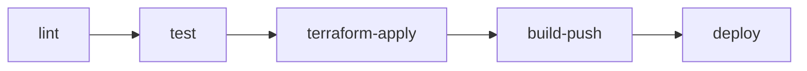

# Design Document: CI/CD Pipeline Hardening

## Overview

This document describes the design for completing and hardening the ShopSmart CI/CD pipeline. The existing `.github/workflows/deploy.yml` has two jobs — `lint` and `deploy` — that partially cover the rubric. The work here restructures the pipeline into five discrete jobs, adds automated testing, introduces Terraform S3 remote state with an AWS Academy fallback, hardens both Dockerfiles, and adds post-deploy ECS stability verification.

No Kubernetes or EKS infrastructure is involved. All container workloads run on AWS ECS Fargate.

### Key Changes at a Glance

| Area | Current State | Target State |
|---|---|---|
| Job count | 2 (`lint`, `deploy`) | 5 (`lint`, `test`, `terraform-apply`, `build-push`, `deploy`) |
| Testing | None | Vitest unit tests for backend + frontend, JUnit XML artifacts |
| Job ordering | `lint → deploy` | `lint → test → terraform-apply → build-push → deploy` |
| Terraform state | Local | S3 remote (with AWS Academy local fallback) |
| AWS_REGION | Hardcoded `env: AWS_REGION: us-east-1` | `secrets.AWS_REGION` |
| Dockerfile.backend | Single-stage, no HEALTHCHECK | Multi-stage (builder + runtime), HEALTHCHECK |
| Dockerfile.frontend | Multi-stage, no HEALTHCHECK | Multi-stage (unchanged), HEALTHCHECK added |
| Post-deploy check | None | `aws ecs wait services-stable` for both services |

---

## Architecture

### Pipeline DAG

The five jobs form a linear dependency chain expressed via `needs` declarations:

```
lint
 └─► test
      └─► terraform-apply
           └─► build-push
                └─► deploy
```



Each arrow represents a `needs` dependency. A job failure at any node stops all downstream nodes. The `test` job runs backend and frontend tests in parallel steps within a single job, so both test suites must pass before `terraform-apply` starts.

### Rationale for Job Boundaries

- **`lint`** — fast static checks with no AWS credentials needed; runs first to fail cheaply.
- **`test`** — executes unit tests before any infrastructure or image work; gates everything downstream.
- **`terraform-apply`** — provisions/updates AWS infrastructure (ECR repos, ECS cluster, task definitions, services) before images are pushed, so the ECR repos exist when `build-push` runs.
- **`build-push`** — builds Docker images and pushes to ECR; runs after infrastructure is confirmed ready.
- **`deploy`** — triggers ECS force-new-deployment and waits for stability; runs last after images are in ECR.

---

## Components and Interfaces

### 5.1 `lint` Job (unchanged)

No changes to this job. It continues to run Terraform fmt check, Terraform validate (with `-backend=false`), and hadolint on both Dockerfiles.

### 5.2 `test` Job

**Job name:** `test`  
**`needs`:** `[lint]`  
**Runner:** `ubuntu-latest`

The job runs backend and frontend test suites as sequential steps within a single job. Both must pass for the job to succeed.

**Steps:**

1. `actions/checkout@v4`
2. `actions/setup-node@v4` with `node-version: '22'`
3. **Backend — Install dependencies**
   ```
   working-directory: server
   run: npm ci
   ```
4. **Backend — Run tests with JUnit reporter**
   ```
   working-directory: server
   run: npx vitest run --reporter=junit --outputFile=test-results/junit.xml
   ```
5. **Backend — Upload JUnit artifact**
   ```
   uses: actions/upload-artifact@v4
   with:
     name: backend-test-results
     path: server/test-results/junit.xml
     if-no-files-found: warn
   ```
   Condition: `if: always()` so the artifact uploads even on test failure (for debugging).
6. **Frontend — Install dependencies**
   ```
   working-directory: client
   run: npm ci
   ```
7. **Frontend — Run tests with JUnit reporter**
   ```
   working-directory: client
   run: npx vitest run --reporter=junit --outputFile=test-results/junit.xml
   ```
8. **Frontend — Upload JUnit artifact**
   ```
   uses: actions/upload-artifact@v4
   with:
     name: frontend-test-results
     path: client/test-results/junit.xml
     if-no-files-found: warn
   ```
   Condition: `if: always()`

**JUnit reporter note:** Vitest ships with a built-in `junit` reporter; no additional package is needed. The `--reporter=junit --outputFile=<path>` flags are passed directly on the CLI. The `server/vitest.config.js` and `client/vite.config.js` do not need to be modified — the CLI flags override/supplement the config-file reporter setting.

**Failure behaviour:** If any test step exits non-zero, the job fails and all downstream jobs (`terraform-apply`, `build-push`, `deploy`) are skipped because they declare `needs: [test]` (directly or transitively).

### 5.3 `terraform-apply` Job

**Job name:** `terraform-apply`  
**`needs`:** `[test]`  
**Runner:** `ubuntu-latest`

This job is extracted from the current monolithic `deploy` job. It handles all Terraform work: S3 backend setup, init, import, plan, and apply.

**Steps:**

1. `actions/checkout@v4`
2. **Validate AWS_REGION secret**
   ```bash
   test -n "${{ secrets.AWS_REGION }}" || \
     (echo "❌ Missing secret: AWS_REGION" && exit 1)
   echo "✅ AWS_REGION secret is present"
   ```
   This step runs before `configure-aws-credentials` so no AWS call is made with a missing region.
3. **Validate other required secrets** (AWS_ACCESS_KEY_ID, AWS_SECRET_ACCESS_KEY, AWS_SESSION_TOKEN, AWS_SUBNET_ID, AWS_SECURITY_GROUP_ID, TF_STATE_BUCKET)
4. `aws-actions/configure-aws-credentials@v4` — uses `secrets.AWS_REGION` (not a hardcoded env var)
5. `hashicorp/setup-terraform@v3` with `terraform_version: ${{ env.TF_VERSION }}`
6. **Setup S3 backend (with AWS Academy fallback)**  
   See §S3 Backend Setup Script below.
7. **Terraform Init** — conditionally uses S3 backend or local state based on output of step 6.
8. **Terraform Import Existing Resources** — same logic as current workflow.
9. **Terraform Plan**
10. **Terraform Apply**

**S3 Backend Setup Script:**

```bash
BUCKET="${{ secrets.TF_STATE_BUCKET }}"
REGION="${{ secrets.AWS_REGION }}"
USE_S3=false

if [ -n "$BUCKET" ]; then
  # Attempt to create or verify the S3 bucket
  if aws s3api head-bucket --bucket "$BUCKET" --region "$REGION" 2>/dev/null; then
    echo "✅ S3 bucket $BUCKET already exists"
    USE_S3=true
  else
    echo "Creating S3 bucket $BUCKET for Terraform state..."
    if aws s3api create-bucket \
        --bucket "$BUCKET" \
        --region "$REGION" \
        --create-bucket-configuration LocationConstraint="$REGION" 2>/dev/null || \
       aws s3api create-bucket \
        --bucket "$BUCKET" \
        --region "$REGION" 2>/dev/null; then

      aws s3api put-bucket-versioning \
        --bucket "$BUCKET" \
        --versioning-configuration Status=Enabled

      aws s3api put-bucket-encryption \
        --bucket "$BUCKET" \
        --server-side-encryption-configuration \
          '{"Rules":[{"ApplyServerSideEncryptionByDefault":{"SSEAlgorithm":"AES256"}}]}'

      aws s3api put-public-access-block \
        --bucket "$BUCKET" \
        --public-access-block-configuration \
          "BlockPublicAcls=true,IgnorePublicAcls=true,BlockPublicPolicy=true,RestrictPublicBuckets=true"

      echo "✅ S3 bucket $BUCKET created with versioning, AES256 encryption, and public-access-block"
      USE_S3=true
    else
      echo "⚠️  WARNING: Could not create S3 bucket (AWS Academy may not support S3 backend). Falling back to local state."
    fi
  fi
else
  echo "⚠️  WARNING: TF_STATE_BUCKET secret not set. Falling back to local state."
fi

echo "USE_S3=$USE_S3" >> $GITHUB_ENV
```

**Terraform Init step** (conditional on `USE_S3`):

```bash
if [ "$USE_S3" = "true" ]; then
  terraform init -upgrade -input=false \
    -backend-config="bucket=${{ secrets.TF_STATE_BUCKET }}" \
    -backend-config="key=shopsmart/terraform.tfstate" \
    -backend-config="region=${{ secrets.AWS_REGION }}" \
    -backend-config="encrypt=true"
  echo "✅ Terraform initialized with S3 remote state"
else
  terraform init -upgrade -input=false -backend=false
  echo "✅ Terraform initialized with local state (fallback)"
fi
```

**Note on `us-east-1` bucket creation:** The AWS S3 API requires that `us-east-1` buckets are created *without* `--create-bucket-configuration` (it's the default region). The script above tries with the LocationConstraint first, then falls back without it, covering both cases.

### 5.4 `build-push` Job

**Job name:** `build-push`  
**`needs`:** `[terraform-apply]`  
**Runner:** `ubuntu-latest`

This job is extracted from the current `deploy` job. It handles ECR login and Docker build+push for both images.

**Steps:**

1. `actions/checkout@v4`
2. Validate `AWS_REGION` secret (same pattern as `terraform-apply`)
3. `aws-actions/configure-aws-credentials@v4` using `secrets.AWS_REGION`
4. `aws-actions/amazon-ecr-login@v2`
5. **Build and push backend image** — same logic as current workflow, using `secrets.AWS_REGION` instead of `env.AWS_REGION`
6. **Build and push frontend image** — same logic as current workflow

### 5.5 `deploy` Job

**Job name:** `deploy`  
**`needs`:** `[build-push]`  
**Runner:** `ubuntu-latest`

This job handles ECS force-new-deployment and stability verification.

**Steps:**

1. `actions/checkout@v4`
2. Validate `AWS_REGION` secret
3. `aws-actions/configure-aws-credentials@v4` using `secrets.AWS_REGION`
4. **Force new deployment — backend**
   ```bash
   aws ecs update-service \
     --cluster shopsmart-cluster \
     --service shopsmart-backend-service \
     --force-new-deployment \
     --region "${{ secrets.AWS_REGION }}"
   echo "✅ Backend service deployment triggered"
   ```
5. **Force new deployment — frontend**
   ```bash
   aws ecs update-service \
     --cluster shopsmart-cluster \
     --service shopsmart-frontend-service \
     --force-new-deployment \
     --region "${{ secrets.AWS_REGION }}"
   echo "✅ Frontend service deployment triggered"
   ```
6. **Wait for backend stability**
   ```bash
   echo "Waiting for backend service to stabilize (timeout: 300s)..."
   aws ecs wait services-stable \
     --cluster shopsmart-cluster \
     --services shopsmart-backend-service \
     --region "${{ secrets.AWS_REGION }}"
   echo "✅ Backend service is stable"
   ```
   The `aws ecs wait services-stable` command polls every 15 seconds with a default maximum of 40 attempts (600s). To enforce a 300s timeout, the step uses a shell timeout wrapper:
   ```bash
   timeout 300 aws ecs wait services-stable \
     --cluster shopsmart-cluster \
     --services shopsmart-backend-service \
     --region "${{ secrets.AWS_REGION }}" || \
   (echo "❌ Backend service failed to stabilize within 300s" && exit 1)
   ```
7. **Wait for frontend stability** — same pattern as step 6, targeting `shopsmart-frontend-service`
8. **Deployment summary** — echo block confirming both services are stable

---

## Data Models

### GitHub Secrets Required

| Secret Name | Used In Jobs | Purpose |
|---|---|---|
| `AWS_ACCESS_KEY_ID` | `terraform-apply`, `build-push`, `deploy` | AWS authentication |
| `AWS_SECRET_ACCESS_KEY` | `terraform-apply`, `build-push`, `deploy` | AWS authentication |
| `AWS_SESSION_TOKEN` | `terraform-apply`, `build-push`, `deploy` | AWS Academy session token |
| `AWS_REGION` | `terraform-apply`, `build-push`, `deploy` | AWS region (replaces hardcoded `us-east-1`) |
| `AWS_SUBNET_ID` | `terraform-apply` | ECS task subnet |
| `AWS_SECURITY_GROUP_ID` | `terraform-apply` | ECS task security group |
| `TF_STATE_BUCKET` | `terraform-apply` | S3 bucket name for Terraform remote state |

### Workflow-Level `env` Block (after change)

```yaml
env:
  TF_VERSION: 1.14.8
  TF_IN_AUTOMATION: true
  TF_VAR_subnet_ids: '["${{ secrets.AWS_SUBNET_ID }}"]'
  TF_VAR_security_group_id: ${{ secrets.AWS_SECURITY_GROUP_ID }}
```

`AWS_REGION` is removed from this block entirely. All references to the region use `${{ secrets.AWS_REGION }}` inline.

### Terraform S3 Backend Block

The `terraform {}` block in `terraform/main.tf` gains a backend declaration:

```hcl
backend "s3" {
  # Values supplied at init time via -backend-config flags
  # bucket, key, region, encrypt are all passed from the workflow
}
```

An empty `backend "s3" {}` block is used so that `terraform init -backend=false` (used in the `lint` job's validate step) continues to work without requiring backend config values.

### JUnit Report Paths

| Artifact Name | File Path in Runner |
|---|---|
| `backend-test-results` | `server/test-results/junit.xml` |
| `frontend-test-results` | `client/test-results/junit.xml` |

These directories are created automatically by Vitest when `--outputFile` is specified.

---

## Dockerfile Designs

### Dockerfile.backend — Multi-Stage Build

**Current:** Single stage, installs prod deps, copies source, creates `appuser`.

**Target:** Two stages — `builder` installs deps, `runtime` copies only what's needed.

```dockerfile
# ── Stage 1: builder ──────────────────────────────────────
FROM node:22-alpine3.21 AS builder

WORKDIR /app

# Install production dependencies only
COPY server/package*.json ./
RUN npm ci --omit=dev

# ── Stage 2: runtime ──────────────────────────────────────
FROM node:22-alpine3.21

WORKDIR /app

# Copy production node_modules from builder (no dev deps)
COPY --from=builder /app/node_modules ./node_modules

# Copy application source and database directory
COPY server/src/ ./src/
COPY server/database/ ./database/

# Create non-root user (preserved from original)
RUN addgroup -S appuser && adduser -S appuser -G appuser

# Switch to non-root user
USER appuser

EXPOSE 5001

HEALTHCHECK --interval=30s --timeout=5s --retries=3 \
  CMD wget -qO- http://localhost:5001/api/health || exit 1

CMD ["node", "src/index.js"]
```

**Design decisions:**
- The `builder` stage runs `npm ci --omit=dev` — since the backend has no build step (no transpilation, no bundling), there is no need to install dev deps in the builder. The `node_modules` produced are already production-only.
- The `runtime` stage copies `node_modules` from `builder` rather than running `npm ci` again, avoiding a second network round-trip and ensuring the final image contains exactly the same modules that were installed in the builder.
- `appuser` is recreated in the `runtime` stage (the `FROM` resets the filesystem). The `RUN addgroup/adduser` lines are preserved verbatim from the original.
- `wget` is available in `node:22-alpine3.21` via the `wget` package which is included in Alpine's base. The health endpoint `/api/health` is confirmed to exist in `server/src/app.js`.

### Dockerfile.frontend — HEALTHCHECK Addition

The frontend Dockerfile already uses a multi-stage build. Only the `HEALTHCHECK` instruction is added to the `nginx` stage:

```dockerfile
# Stage 2: Serve with Nginx  (existing content, HEALTHCHECK added)
FROM nginx:1.28-alpine3.21

COPY --from=builder /app/dist /usr/share/nginx/html

EXPOSE 80

HEALTHCHECK --interval=30s --timeout=5s --retries=3 \
  CMD wget -qO- http://localhost:80 || exit 1

# CMD inherited from nginx base image
```

**Design decision:** `wget` is available in `nginx:1.28-alpine3.21` (Alpine includes it). The probe hits `http://localhost:80` (the Nginx default page), which is sufficient to confirm the server is accepting connections. A more specific path is not needed since the frontend serves static files with no application-level health endpoint.

---

## Error Handling

### Secret Validation

Each job that makes AWS API calls includes an explicit secret validation step as its first substantive step (after checkout), before `configure-aws-credentials`. The pattern is:

```bash
test -n "${{ secrets.AWS_REGION }}" || \
  (echo "❌ Missing secret: AWS_REGION" && exit 1)
```

This ensures the pipeline fails with a clear, human-readable message rather than a cryptic AWS CLI error. The `terraform-apply` job validates all seven secrets listed in the Data Models section.

### S3 Backend Fallback

If the S3 bucket cannot be created or accessed (AWS Academy restriction), the pipeline logs a warning and continues with local state. This is a graceful degradation — the pipeline still deploys successfully, just without shared remote state. The `USE_S3` environment variable is set in `$GITHUB_ENV` so the subsequent Terraform Init step can branch on it.

### ECS Stability Timeout

The `timeout 300` wrapper on `aws ecs wait services-stable` ensures the step fails within 5 minutes if a service doesn't stabilize. The error message names the specific service that failed, making it easy to identify whether the backend or frontend rollout is the problem. The two wait steps are sequential (not parallel) so the failure attribution is unambiguous.

### Test Artifact Upload on Failure

Both JUnit artifact upload steps use `if: always()`. This means the XML report is uploaded even when tests fail, allowing developers to inspect the failure details in the GitHub Actions UI without needing to re-run the pipeline.

---

## Testing Strategy

This feature is CI/CD pipeline configuration and Dockerfile changes — it is IaC-like in nature. Property-based testing is not applicable because:

- The acceptance criteria describe configuration structure (workflow YAML, Dockerfile instructions, Terraform blocks), not functions with varying inputs.
- The behavior is deterministic: either a step exists with the correct configuration, or it doesn't.
- Running 100 iterations of "does this YAML have a `needs` declaration" adds no value over a single check.

The appropriate testing strategies are:

**Smoke tests (configuration verification):**
- Verify the workflow YAML has the correct 5-job structure with proper `needs` declarations.
- Verify `AWS_REGION` is not present in any `env:` block and all references use `secrets.AWS_REGION`.
- Verify both Dockerfiles contain `HEALTHCHECK` instructions with `--interval`, `--timeout`, and `--retries`.
- Verify `Dockerfile.backend` has two `FROM` stages (`AS builder` and the runtime stage).
- Verify `terraform/main.tf` has a `backend "s3" {}` block.
- Verify JUnit artifact upload steps exist with `if: always()`.

**Example-based tests:**
- Verify the S3 fallback script logs a warning and sets `USE_S3=false` when `TF_STATE_BUCKET` is empty.
- Verify the `AWS_REGION` validation step exits non-zero when the secret is absent.

**Integration tests (manual / pipeline execution):**
- Push to `main` with all secrets configured and verify the full 5-job pipeline runs to completion.
- Verify JUnit XML artifacts appear in the GitHub Actions run summary.
- Verify ECS services reach stable state after deployment.
- Verify Terraform state is stored in the S3 bucket after a successful run.

**Dockerfile build tests:**
- `docker build -f Docker/Dockerfile.backend .` — verify the multi-stage build completes without error.
- `docker build -f Docker/Dockerfile.frontend .` — verify the build still completes after adding HEALTHCHECK.
- `docker inspect <image> | jq '.[0].Config.Healthcheck'` — verify HEALTHCHECK is present in the built image metadata.
